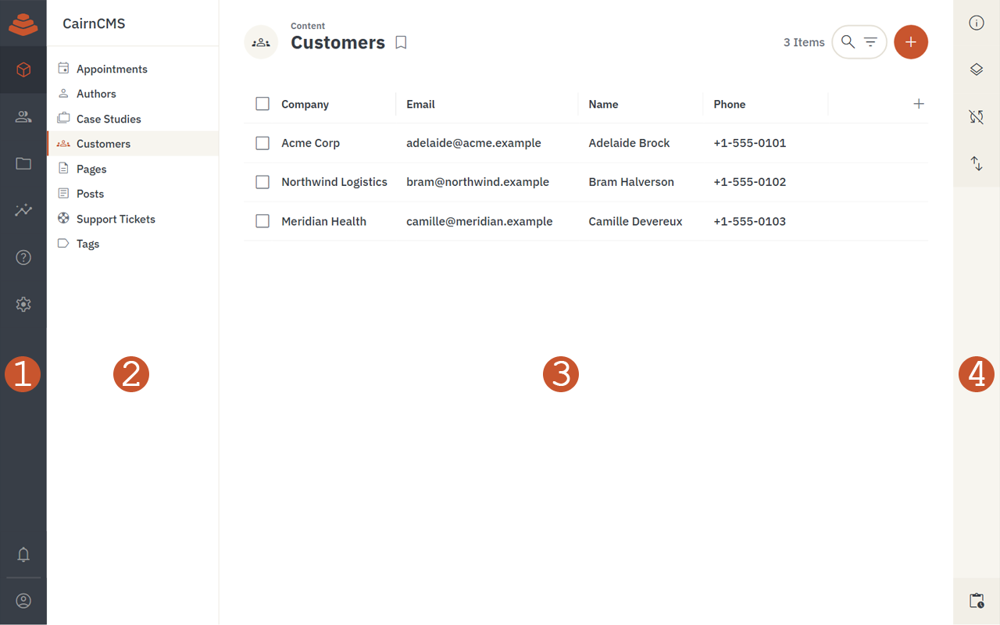

The admin app is the browser-based interface for working with your data, files, users, dashboards, and platform settings. It is organized left-to-right around modules, navigation, and the current page, with a contextual sidebar on the right.

The four numbered areas in the screenshot map to the sections below. The module bar (1) and the sidebar (4) are always present. The navigation pane (2) and the page (3) change to match whichever module you are in.

## 1. Module bar

The leftmost column of the app. It is the top-level switch between the major areas of the platform.

- **Project logo** — Displays the configured project logo and accent color. Acts as an indeterminate progress indicator while the platform is working in the background.
- **Module navigation** — Buttons for the modules your role has access to. The default modules are:
  - **Content** — Browse and edit records in your collections.
  - **User directory** — Manage system users.
  - **File library** — Upload and organize files.
  - **Insights** — View and build dashboards.
  - **Help** — In-app reference for using the app.
  - **Settings** — Admin-only project and system configuration.
- **Notifications** — Opens a tray of recent activity, including comments where you are mentioned.
- **Current user menu** — Shows your avatar and name, with a sign-out action on hover.

## 2. Navigation pane

Sits to the right of the module bar and changes based on the active module. It is the second-level navigation inside whichever module you have chosen.

- **Project name** — The name of the current CairnCMS project, with a small connection indicator that confirms the app is reaching the API.
- **Module navigation** — A dynamic list of the items inside the current module. In Content, this is the collections you can read; in Insights, the dashboards; in Settings, the configuration groups.
- **Bookmarks and presets** — Saved filtered or sorted views of a collection, shown below the collection list when present.

## 3. Page

The main work area, unique to whatever route you are on. Everything else in the layout is structural; this is the only area that changes per page.

- **Header** — Fixed at the top of the page.
  - **Page icon** — Navigates back to the previous page.
  - **Module label** — Small text above the title; navigates to the parent module.
  - **Page title** — The name of the current page.
  - **Action buttons** — Right-aligned, contextual to the page (search, filter, add, save, and so on).
- **Page content** — The body of the page. For a collection, this is the item list in whichever layout is active. For an item detail page, it is the form for that record. For dashboards, files, and settings pages, it shifts to match the page's purpose.

## 4. Sidebar

Runs along the right edge of the app and provides context for the current page.

- **Sections** — Contextual tools for the current page. Click an icon to expand a section; click again to collapse it. Common sections include:
  - **Info** — Available on every page; explains the purpose of the page and any useful details.
  - **Layout options** — Layout-specific controls for collection views (columns, spacing, grouping, and so on).
  - **Visibility and sort** — Per-page toggles for showing or hiding fields and ordering items.
- **Activity tray** — Pinned to the bottom of the sidebar; opens recent activity and links to the full activity log.

If your browser window is wide enough, the sidebar opens automatically. On narrower windows it stays collapsed so the page itself has more room.

## Where to go next

Once you have a feel for the layout:

- [Quickstart](/docs/getting-started/quickstart/) walks through creating a collection, adding a record, and reading it back through the API.
- [Architecture](/docs/getting-started/architecture/) covers what is happening behind the app, including how the same data is reachable through REST and GraphQL.
- [Glossary](/docs/getting-started/glossary/) defines the terms used throughout the app and the rest of the docs.
